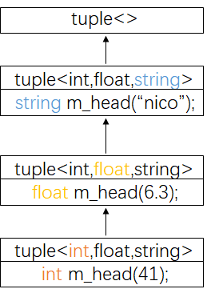

## Variadic Templates
参数数量不定的模板参数
```cpp
//1
void print()
{

}
//2
template<typename T,typename... Types>
void print(const T& firstArgs,const Types&... args)
{
    cout<< firstArg << endl; //print first argument;
    print(args...);          //call print() for remaining arguments
}
```
`const Types&... args`表示函数会接收任意数量的参数，而且每一个参数的type都是任意的。这个功能可以帮助我们递归函数调用，递归调用的目的是为了分解不定数量的参数。
```cpp
print(7.5,"hello",bitset<16>(377),42);
```
第一次调用，第一个参数是7.5，其余参数是["hello",bitset<16>(377),42]；
第二次调用，第一个参数是"hello"，其余参数[bitset<16>(377),42]；
第三次调用，第一个参数是"bitset<16>(377)，其余参数是42；
第四次调用，第一个参数是42，其余参数为空；
第五次调用，参数为空，到达边界条件，此时调用`print()`函数。

因此上面的代码会递归调用print()函数。最终会打印出7.5,hello,00000001011111001,42。

**...** 就是一个所谓的**pack**(包)
用于template parameters，就是template parameters **pack**(模板参数**包**)
用于function parameter types，function parameters types **pack**(函数参数类型**包**)
用于function parameters，就是function parameters **pack**(函数参数**包**)

在边长模板中，`sizeof...(args)`计算参数的数量。


```cpp
//3
template<typename... Types>
void print(const Types&... args)
{/*...*/}
```
代码2和代码3可以并存吗？如果可以，谁比较泛化，谁比较特化？

### 可以很方便地完成recursive function call(例子1)

```cpp
class CustomerHash{
public:
    std::size_t operator()(const Customer& c) const{
        return hash_val(c.fname,c.lname,c.no);
    }
};
```
简述上面类的成员函数的调用逻辑

```cpp
//1
template<typename.. Types>
inline size_t hash_val(const Types&... args){
    size_t seed = 0;
    hash_val(seed,args...);
    return seed;
}
```
函数1接收一包参数

```cpp
//2
template<typename T,typename.. Types>
inline void hash_val(size_t& seed,const T& val,const Types&... args){
    hash_combine(seed,val);
    hash_val(seed,args...);  // recursive
}
```
函数2接收3个参数，分别是第一个参数、第二个参数、一包参数。
```cpp
//3
template<typename T>
inline void hash_val(size_t& seed,const T& val){
    hash_combine(seed,val);
}
```
函数3接收2个参数，分别是第一个参数，一包参数。
```cpp
//4
#include<functional>
template<typename T>
inline void hash_combine(size_t& seed,const T& val){
    seed ^= std::hash<T>()(val) + 0x9e3779b9+seed(<<6)+(seed>>2);
}
```
1. 根据参数类型可知，成员函数先调用函数1；
2. 由于函数2比函数1内部的`hash_val(seed,args...)`更加特化，所以函数1会调用函数2；
3. 函数2调用函数4即`hash_combine(size_t& seed,const T& val)`；
4. 函数2开始递归调用自身；
5. 函数2到达递归边界，入参的一包参数数量为0。恰好调用函数3。


### 可以很方便地完成recursive function call(例子2)
tuple 是一个可以放置任意数量任意类型元素的集合。
```cpp
template<typename... Values>class tuple;
template<> class tuple<>{};
```

```cpp
template<typename Head,typename... Tail>
class tuple<Head,Tail>
:private tuple<Head,Tail...>  // 可以很方便的完成recursive inheritance
{
    typedef tuple<Tail...> inherited;
    public:
        tuple(){}
        tuple(Head v,Tail... vtail)
            // 注意这里是initialization list
            :m_head(v),inherited(vtail...){} // 调用base ctor 并给参数(不要误认为是创建tmp object)

        typename Head::type head(){return m_head;}
        inherited& tail(){return *this;}
    protected:
        Head m_head;
};
```
首先看下递归继承是如何完成的。例如`tuple<int,float,string>t(41,6.3,"nico")`，它的递归继承关系如下：
<div align=center>

</div>

注意递归的边界函数`template<> class tuple<>{};`

### nullptr and std::nullptr_t
C++11允许你用


### Initializer List
```cpp
int i; // i has undefined value
int j{}; // j is initialized by 0
int* p; // p has undefined value
int* q{}; // q is initialized by nullptr
```
Note, however, that narrowing initializations — those that reduce precision or where the supplied value gets modified — are not possible with braces. For example:
```cpp
int x1(5.3); // OK, but OUCH: x1 becomes 5
int x2 = 5.3; // OK, but OUCH: x2 becomes 5
int x3{5.0}; // ERROR: narrowing
int x4 = {5.3}; // ERROR: narrowing
char c1{7}; // OK: even though 7 is an int, this is not narrowing
char c2{99999}; // ERROR: narrowing (if 99999 doesn’t fit into a char)
std::vector<int> v1 { 1, 2, 4, 5 }; // OK
std::vector<int> v2 { 1, 2.3, 4, 5.6 }; // ERROR: narrowing doubles to ints
```

To support the concept of initializer lists for user-defined types, C++11 provides the class template `std::initializer_list<>`. It can be used to support initializations by a list of values or in any other place where you want to process just a list of values. For example:
```cpp
void print (std::initializer_list<int> vals)
{
for (auto p=vals.begin(); p!=vals.end(); ++p) { // process a list of values
std::cout << *p << "\n";
}
}
print ({12,3,5,7,11,13,17}); // pass a list of values to print()
```

When there are constructors for both a specific number of arguments and an initializer list, the version with the initializer list is preferred:
```cpp
class P
{
public:
    P(int a,int b)
    {
        cout << "P(int,int),a = " <<  a << ",b=" << b << endl;
    }
    P(std::initializer_list<int>)
    {
        cout << "P(initializer_list<int>),value=";
        for(auto i:initlist)
            cout << i << ' ';
        cout << endl;
    }
};
P p(77,5); // calls P::P(int,int)
P q{77,5}; // calls P::P(initializer_list) 
P r{77,5,42}; // calls P::P(initializer_list)
P s = {77,5}; // calls P::P(initializer_list)
```

Without the constructor for the initializer list, the constructor taking two ints would be called to initialize q and s, while the initialization of r would be invalid.

```cpp
class P
{
public:
    P(int a,int b)
    {
        cout << "P(int,int),a = " <<  a << ",b=" << b << endl;
    }
    P(std::initializer_list<int>)
    {
        cout << "P(initializer_list<int>),value=";
        for(auto i:initlist)
            cout << i << ' ';
        cout << endl;
    }
};

```
initializer_list objects are automatically constructed as if an array of elements of type T was allocated, with each of the elements in the list being copy-initialized to its corresponding element in the array, using any necessary non-narrowing implicit conversions.

The initializer_list object refers to the elements of this array without containing them: copying an initializer_list object produces another object referring to the same underlying elements, not to new copies of them (reference semantics).

The lifetime of this temporary array is the same as the initializer_list object.


### explicit for ctors taking more than one argument
`explict`只用在构造函数里面，显示的禁止隐式的转换。在C++2.0以前，只能用于带有一个实参的构造函数，叫做nonexplict one argument constructor。
```cpp
class P
{
public:
    P(int a,int b)
    {
        cout << "P(int,int),a = " <<  a << ",b=" << b << endl;
    }
    P(std::initializer_list<int>)
    {
        cout << "P(initializer_list<int>),value=";
    }
    explicit P(int a, int b, int c) {
        cout << "explicit P(int a, int b, int c) \n";
    }
};

void fp(const P&){ };
```

### Range-Based for Loops
```cpp
for ( int i : { 2, 3, 5, 7, 9, 13, 17, 19 } ) {
    std::cout << i << std::endl;
}
```
```cpp
std::vector<double> vec;
...
for (auto elem : vec){
    cout << elem << endl;
}

for ( auto& elem : vec ) {
    elem *= 3;
}
```

```cpp
for ( decl : coll ) {
    statement
}

```

```cpp
{
    for (auto _pos=coll.begin(); _pos != coll.end(); ++_pos ) {
        decl = *_pos;
        statement
    }
}

```
is equivalent to the following, if coll provides begin() and end() members:
```cpp
{
    for (auto _pos=begin(coll), _end=end(coll); _pos!=_end; ++_pos ) {
        decl = *_pos;
        statement
    }
}

```

```cpp
template <typename T>
void printElements (const T& coll)
{
    for (const auto& elem : coll) {
        std::cout << elem << std::endl;
    }
}

```

```cpp
{
    for (auto _pos=coll.begin(); _pos != coll.end(); ++_pos ) {
        const auto& elem = *_pos;
        std::cout << elem << std::endl;
    }
}

```

### explicit

Note that no explicit type conversions are possible when elements are initialized as decl inside the for loop. Thus, the following does not compile:
```cpp
class C
{
    public:
        explicit C(const std::string& s); // explicit(!) type conversion from strings
        ...
};


std::vector<std::string> vs;
for (const C& elem : vs) { // ERROR, no conversion from string to C defined
    std::cout << elem << std::endl;
}

```

### =default，=delete
如果你自行定义了一个ctor，那么编译器就不会再给你一个 `default ctor`。

如果你强制加上=default，就可以重新获得并使用`default ctor`

一般的函数没有=default和=delete的功能。

```cpp

class Zoo
{
public:
    Zoo(int i1,int i2):d1(i1),d2(i2){ }
    Zoo(comst Zoo&) = delete;
    Zoo(Zoo&&) = default;
    Zoo& operator=(const Zoo&) =default;
    Zoo& operator=(const Zoo&) =delete;
    virtual ~Zoo(){ }
private:
    int d1,d2;
}

```
**构造函数可以有多个，但拷贝构造函数和拷贝赋值构造函数只能有一个。**
```cpp
class Foo
{
public:
    Foo(int i):_i(i){ }
    Foo() = default // 和上一个ctor同时存在

    Foo(const Foo& x):_i(x._i){ }
    Foo(const Foo&) = default;  // [Error]'Foo::Foo(const Foo&)' cannot be overload
    Foo(const Foo&) = delete;  // [Error]'Foo::Foo(const Foo&)' cannot be overload

    Foo& operator=(const Foo& x){_i = x._i;return *this;}
    Foo& operator=(const Foo& x){_i = x._i;return *this;}// [Error]'Foo::Foo& operator=(const Foo& x)' cannot be overload
    Foo& operator=(const Foo& x){_i = x._i;return *this;}// [Error]'Foo::Foo& operator=(const Foo& x)' cannot be overload

    void func1() = default; //[Error]'void Foo::func1()'cannot be defaulted
    void func2() = delete; // OK

    ~Foo()=delete; // 这会造成Foo object 时出错，=> [Error]use of deleted function 'Foo::~Foo()'
    ~Foo()=default; //

private:
    int _i;
}

```
**=default;**用于Big-Five之外是何意义？——>无意义，编译会报错。
**=delete；**可以用在任何函数身上(=0只能用于virtual函数)。

如果一个类含有指针，通常要写Big-Three，如果一个类不含有指针，则绝大部分使用默认的Big-Three就够了


### 移动语义和右值引用

### 移动语义
右值引用主要解决下面两个问题
- 实现移动语义
- 完美转发

#### 左值
可能出现在赋值语句左边或者右边的表达式。

#### 右值
只能出现在赋值语句右边的表达式。

例如：
```cpp
int a = 42;
int b = 43;

// a 和 b都是左值
a = b // ok
b = a // ok
a = a * b // ok

// a * b 是右值
int c = a * b; // ok 右值在赋值语句的右边
a * b = 42; // error, 右值在赋值语句的左边
```
另外一种定义
#### 左值
左值是指向一块内存的表达式且可以通过运算符`&`获取该内存的地址。

#### 右值
不是左值的表达式就是右值。

```cpp
// 左值:
//
int i = 42;
i = 43; // ok, i是左值
int* p = &i; // ok, i是左值
int& foo();
foo() = 42; // ok, foo()是左值
int* p1 = &foo(); // ok, foo()是左值

// 右值:
//
int foobar();
int j = 0;
j = foobar(); // ok, foobar()是右值
int* p2 = &foobar(); // error, 不能获取右值的地址
j = 42; // ok, 42是右值

```

#### 移动语义
假设X是一个含有指针成员的类，这个指针指向某种资源，例如`m_pResource`。X的拷贝赋值构造函数是以下形式：
```cpp
X& X::operator=(X const & rhs)
{
  // [...]
  // Make a clone of what rhs.m_pResource refers to.
  // Destruct the resource that m_pResource refers to. 
  // Attach the clone to m_pResource.
  // [...]
}

```
现在如果X按照如下方式使用：
```cpp
X foo();
X x;
// perhaps use x in various ways
x = foo();
```
最后一行的含义：
- 从foo返回的临时对象中拷贝资源
- 销毁对象x持有的资源，并用克隆的资源替换它
- 销毁临时对象，从而释放其资源。

很明显，直接在对象x和临时对象之间交换资源指针，然后让临时对象的析构函数销毁原始资源会更有效率。换句话说，赋值语句的右边是一个右值，我们希望拷贝复制运算符也可以想这样使用：

```cpp
// [...]
// swap m_pResource and rhs.m_pResource
// [...]  
```
上面这种交换方式称为移动语义。在C++11中，这种条件行为可以通过重载实现：
```cpp
X& X::operator=(<mystery type> rhs)
{
  // [...]
  // swap this->m_pResource and rhs.m_pResource
  // [...]  
}
```
因为重载了拷贝赋值运算符，所以`mystery type` 一定是一个引用。即拷贝赋值中=的右边是按照引用传递的。其中，一个函数的入参是常规引用，另一个函数的入参是`mystery type`。另外我们希望它还有另外一个行为：当选择两个重载函数之一时，右值对应于`mystery type`，左值对应于常规引用。

其实上面的`mystery type`就是右值引用。


#### 右值引用

假设X是任意类型，`X&&`称为X的右值引用。为了更好的区分，之前的常规引用`X&`称为左值引用。

右值引用也是一种类型，它的性质和左值引用`X&`非常类似。但它们一个最主要的区分在于解决函数重载问题，左值适用于左值引用，右值适用于右值引用。
```cpp
void foo(X& x); // lvalue reference overload
void foo(X&& x); // rvalue reference overload

X x;
X foobar();

foo(x); // argument is lvalue: calls foo(X&)
foo(foobar()); // argument is rvalue: calls foo(X&&)
```
你可以按照上面的方式重载任何一个函数。但是在绝大多数情况下，为了实现移动语义，这种重载应该只出现在拷贝构造函数和拷贝赋值构造函数中。

```cpp
X& X::operator=(X const & rhs);// classical implementation
X& X::operator=(X&& rhs);
{
  // Move semantics: exchange content between this and rhs
  return *this;
}
```
拷贝构造函数右值引用重载实现方式和上面类似。

注意：
如果实现了
```cpp
void foo(X&);
```
但没有实现
```cpp
void foo(X&&);
```
很明显，`foo`可以被左值调用，但不能被右值调用。

如果实现了
```cpp
void foo(X const &);
```
却没有实现
```cpp
void foo(X&&);
```
同样地，foo 不仅可以被左值调用也可以被右值调用，但编译器无法区分应该使用左值还是右值，只有当你实现了
```cpp
void foo(X&&);
```
才会区分。

最后，如果实现了
```cpp
void foo(X&&);
```
但没有实现下面两个函数中的任何一个
```cpp
void foo(X&);
void foo(X const &);
```
那么，根据C++11的最终标准，foo可以被右值调用，用左值调用会引起编译器报错。

#### 强制移动语义
C++11 不仅可以在右值上使用移动语义，也可以在左值上使用移动语义。
假设X是一个已经重载了拷贝构造函数和拷贝赋值构造函数的类。
```cpp
template<class T>
void swap(T& a, T& b) 
{ 
  T tmp(a);
  a = b; 
  b = tmp; 
} 

X a, b;
swap(a, b);
```
上面的代码里没有右值，因此swap函数内部没有使用移动语义。我们知道，当一个变量作为拷贝构造函数或者拷贝赋值构造函数的源对象时，这个变量要么最终不再使用，要么它只作为赋值语句的源对象。所以swap函数使用移动语义也是可以的。

在C++11中可以使用标准库函数`std::move`来强制实现移动语义。这个函数的作用只是把参数转为右值。在C++11中标准库函数swap实际看起来是这样的：
```cpp
template<class T> 
void swap(T& a, T& b) 
{ 
  T tmp(std::move(a));
  a = std::move(b); 
  b = std::move(tmp);
} 

X a, b;
swap(a, b);
```
这样新的swap函数内部就都使用了移动语义。

考虑简单的变量之间的赋值
```cpp
a = b;
```
我们期望a持有的对象被b的副本替换，并且在替换期间，a之前持有的对象将会被销毁。接着考虑：
```cpp
a = std::move(b);
```
如果移动语义的实现只是简单的交换。那么它的作用就是a和b持有的对象在a和b之间被交换。此时并没有任何对象被销毁。当然，一旦b离开时作用域之后，a之前持有的对象最终会被销毁。因此，就此前讨论的拷贝赋值运算符的实现而言，的确不知道a之前持有的对象什么时候会被销毁。

至此，我们陷入了一个比较严重的问题：一个变量被赋值了，但那个变量之前持有的对象依旧存在某个地方。

所以，任何一个可能带有这种副作用的对象销毁应该在拷贝赋值运算符的右值引用重载中被显式执行：

```cpp
X& X::operator=(X&& rhs)
{

  // Perform a cleanup that takes care of at least those parts of the
  // destructor that have side effects. Be sure to leave the object
  // in a destructible and assignable state.

  // Move semantics: exchange content between this and rhs
  
  return *this;
}
```

#### 右值引用是右值吗？
和之前一样,令X是个类，它已经重载了拷贝构造函数和拷贝赋值运算符以实现移动语义。现在考虑：
```cpp
void foo(X&& x)
{
  X anotherX = x;
  // ...
}
```
一个有趣的问题：函数foo体内会调用类X哪个版本的拷贝构造函数？
这里x是一个被声明为右值引用的变量，它更适合且通常引用一个右边值。因此x看似很有可能像右值一样被绑定。即：
```cpp
X(X&& rhs)
```
应该被调用。换句话说，人们可能会认为右值引用本身也应该是右值。为了解决这个问题，右值的设计者选择了一个稍微有点复杂的解决方案：

> 如果一个变量被声明为右值引用，它可能是左值和右值。区别的准则是：如果这个变量有名称，那么它就是左值。否则它是右值。

在上面的例子中，被声明为右值引用的东西有一个名称，因此它是一个左值。
```cpp
void foo(X&& x)
{
  X anotherX = x; // calls X(X const & rhs)
}
```
下面的例子中，它被声明为右值引用，但没有名字，因此它是一个右值。
```cpp
X&& goo();
X x = goo(); // calls X(X&& rhs) because the thing on
             // the right hand side has no name
```
这样设计的原因是：
> 允许移动语义可以潜移默化的运用到某些有名称的事物上。

下面的代码：
```cpp
X anotherX = x;
  // x is still in scope!
```
很容易造成混淆且容易出错。


“有名称就是左值”的另一面是“没有名称就是右值”？回顾上面goo()函数的例子，这句话在理论上是成立的，尽管不太可能，

所以表达式：
```cpp
std::move(x)
```
被声名为一个右值引用且没有名字。因此它是一个右值。所以
> std::move函数通过“隐藏参数的名称”把它的参数转化为右值，即便参数并不是右值。


这里有个例子会让你意识到“有名称就是左值”这个规则的重要性。
假如你写了一个类Base，已经通过重载Base的拷贝构造函数和拷贝赋值运算符来实现移动语义：
```cpp
Base(Base const & rhs); // non-move semantics
Base(Base&& rhs); // move semantics
```
现在你又写了一个继承自Base的类Derived。为了确保移动语义可以作用到Derived的Base部分，你还必须重载Derived的拷贝构造函数和拷贝赋值运算符。现在看一下拷贝构造函数，拷贝赋值运算符的处理是类似的。左值的版本很简单：
```cpp
Derived(Derived const & rhs) 
  : Base(rhs)
{
  // Derived-specific stuff
}
```
右值的版本有很大不同的地方。很多人没有意识到如果使用“有名称就是左值”的规则，它很有可能会这样做：
```cpp
Derived(Derived&& rhs) 
  : Base(rhs) // wrong: rhs is an lvalue
{
  // Derived-specific stuff
}
```
如果我们按照上面的方式编码，那么Base拷贝构造函数的非移动语义版本就会被调用。因为rhs有一个名称，它是一个左值。但是我们想调用的是Base的拷贝构造函数的移动语义版，正确的写法是这样的：
```cpp
Derived(Derived&& rhs) 
  : Base(std::move(rhs)) // good, calls Base(Base&& rhs)
{
  // Derived-specific stuff
}
```

#### Move Semantics and Compiler Optimizations
考虑如下的函数定义：
```cpp
X foo()
{
  X x;
  // perhaps do something to x
  return x;
}
```
和之前的假设一样，令X是一个类，我们已经重载了拷贝构造函数和拷贝赋值运算符以实现移动语义。如果从表面上理解函数的定义，你可能会说，等下，从x到foo函数返回值的位置之间发生了值的拷贝。我来通过下面的方式确保它的确用了移动语义：
```cpp
X foo()
{
  X x;
  // perhaps do something to x
  return std::move(x); // making it worse!
}
```
不幸的是，这样会让事情变得更糟糕而不是更好。任何现代编译器都会对原始函数定义应用返回值优化。换句话说，编译器会在函数foo返回值的位置直接构造类X的对象，而不是在局部构造对象然后将它拷贝出去。很明显，这样甚至比移动语义更好。

如上所示，如果你真的想用最优的方式使用右值引用和移动语义，你需要充分理解并考虑现代编译的一些特殊影响例如返回值优化和拷贝省略。有关详细讨论，请参阅Scott Meyers的《有效的现代c++》一书中的第25和41项。它变得非常微妙，但是，嘿，我们选择c++作为我们选择的语言是有原因的，对吧?
我们整理了床铺，现在让我们躺在上面。


### 完美转发
#### 问题
除了移动语义，右值引用所要解决的另一个问题是完美转发。考虑下面一个简单的工厂函数：
```cpp
template<typename T, typename Arg> 
shared_ptr<T> factory(Arg arg)
{ 
  return shared_ptr<T>(new T(arg));
} 
```
很明显，这里的目的是将参数arg从工厂函数转发到T的构造函数。

### 字符串字面值


### 关键字noexcept


### 关键字constexper


### Lambdas


### 关键字decltype


### 新的函数声明语法


### 新的基础数据类型
- char16_t and char32_t
- long long and unsigned long long
- std::nullptr_t


参考1：http://thbecker.net/articles/rvalue_references/section_03.html
参考2：https://josephmansfield.uk/articles/lvalue-rvalue-metaphor.html
参考3：https://isocpp.org/blog/2012/11/universal-references-in-c11-scott-meyers


参考4:https://www.zhihu.com/search?type=content&q=%E5%B7%A6%E5%80%BC%E5%92%8C%E5%8F%B3%E5%80%BC

参考5：https://www.artima.com/cppsource/rvalue.html