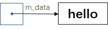
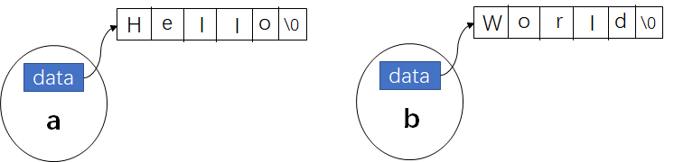
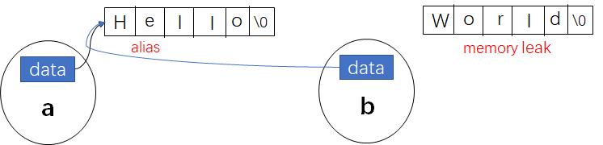
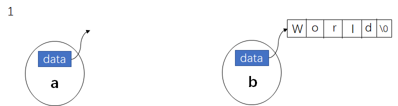
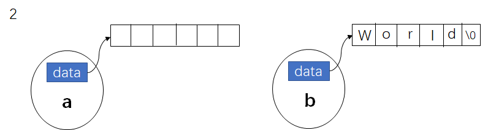
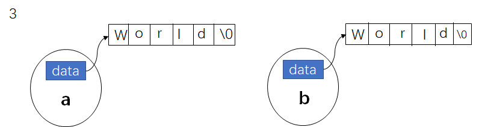
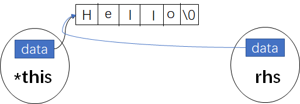
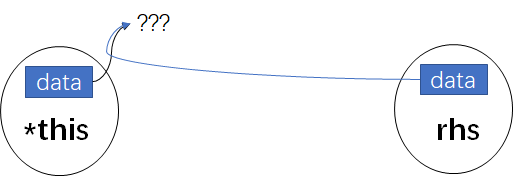
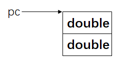
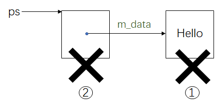

# ➕ 面向对象高级编程
Classes 的两个经典分类
Class without pointer member(s)
- complex


Class with pointer member(s)
- string

**complex.h**

```cpp
#ifndef __COMPLEX
#define __COMPLEX__

class complex
{
public:
    complex (double r = 0,double i = 0)
        : re(r).im(i)
    {}
    complex& operator += (const complex&);
    double real () const {return re;}
    double imag () const {return im;}

private:
    double re,im;

    friend complex& __doapl (complex* ,const complex&);
};
#endif
```

```cpp

inline comlex& __doapl(complex* ths,const complex& r)
{
    ths->re += r.re;
    ths->im += r.im;
    return *this;
}


inline complex& complex::operator += (const complex& r)
{
    return __doapl(this,r)
}

inline complex operator + (const complex& x,const complex& y)
{
    return complex(real(x) + real(y),imag(x)+imag(y));
}

inline complex operator + (const complex& x,double y)
{
    return complex(real(x) + y ,imag(x);
}

inline complex operator + (double x,const complex& y)
{
    return complex(x + real(y),imag(y));
}


operator << (ostream& os,const complex& x)


```

**complex-test.h**
```cpp
#include <iostream>
#include "complex.h"
using namespace std;

int main()
{
    complex c1(2,1);
    complex c2;
    cout << c1 << endl;
    cout << c2 << endl;    

    c2 = c1 + 5;
    c2 = 7 + c1;
    c2  = c1 + c2;
    c2 += c1;
    c2 += 3;
    c2 = -c1;

    cout << (c1 == c2) << endl;
    cout << (c1 != c2) << endl;
    cout << conj(c1) << endl;
}

```


**string.h**
```cpp
#inndef __MYSTRING__
#define __MYSTRING__

class String
{
...
}

String::function(...) ...

Global-function(...) ... 


#endif
```
**string-test.h**
```cpp
int main()
{
    String s1();
    String s2("hello");

    String s3(s1);
    cout << s3 << endl;

    s3 = s2;
    cout << s3 << endl;
}


```


## 头文件与类的声明
### Header(头文件)中的防卫式声明
```cpp
#ifndef __COMPLEX
#define __COMPLEX__

...

#endif
```
当程序第一次include头文件时，就会定义__COMPLEX__，第二次include的时候，__COMPLEX__已经定义过了，无需再次定义。这样就防止头文件被多次包含，让使用者避免为了使用头文件，需要先include A ，再inclue B，再include C的情况出现，这样负担太重。

### Header(头文件)的布局
```cpp
#ifndef __COMPLEX
#define __COMPLEX__

#include <cmath>

class complex;  // 1.forward declarations(前置声明)

 comlex& __doapl(complex* ths,const complex& r); 


class complex  // 2.class declarations(类声明)
{
    ...  
}


complex::function ... // class definition (类-定义)

#endif

```
### class 的声明
```cpp
class complex // class head
{  // class body ({}包含的)
public:
    complex (double r = 0,double i = 0)
        : re(r).im(i)
    {}
    complex& operator += (const complex&);
    double real () const {return re;}
    double imag () const {return im;}

private:
    double re,im;

    friend complex& __doapl (complex* ,const complex&);
};
```

```cpp
complex c1(2,1);
complex c2;
```

### class template(模板) 简介
```cpp
template<typename T> 
class complex // class head
{  // class body ({}包含的)
public:
    complex (T r = 0,T i = 0)
        : re(r).im(i)
    {}
    complex& operator += (const complex&);
    T real () const {return re;}
    T imag () const {return im;}

private:
    T re,im;

    friend complex& __doapl (complex* ,const complex&);
};

```
```cpp
complex<double> c1(2.5,1.5);
complex<double> c2(2,6);
```

## 构造函数
### inline(内联)函数
函数若在class body内定义完成，便自动成为inline候选人，在外部定义则不是。inline 像宏一样，但不是完全一样，有宏的特性，没有宏的缺点。

不是所有的函数都可以inline，如果函数太复杂，就无法inline，即使写了inline，也只是对编译器的建议，是不是真的变成inline，由编译器决定。

```cpp
class complex 
{  
public:
    complex (double r = 0,double i = 0)
        : re(r).im(i)
    {}  // inline 函数
    complex& operator += (const complex&);  // 不是inline函数
    double real () const {return re;}  // inline 函数
    double imag () const {return im;}  // inline 函数

private:
    double re,im;

    friend complex& __doapl (complex* ,const complex&);
};
```
### 访问级别
`puclic` 可以被外界看到，公开的。`private`只有class 本身可以看到，一般存放的是类的数据。

下面的代码会报错
```cpp

complex c1(2,1)
cout << c1.re;
cout << c1.im;
```
下面的代码是合法的
```cpp
complex c1(2,1);
cout << c1.real();
cout << c1.imag();
```

### constructor(ctor，构造函数)
构造函数没有返回类型。
```cpp
complex (double r = 0,double i = 0) // default argument(默认实惨)
: re(x),im(i) // initialization list(初指列，初始列)
{ }
```
**一定要利用构造函数特有的列表初始化来初始化数据，不要在构造函数体内赋值**。
```cpp
complex (double r = 0,double i = 0) // default argument(默认实惨)
{ re = r;im = i;}

```
一个变量的数值设定有两个阶段，一个是初始化，一个是赋值(assignment)，因此我们可以利用变量的初始化阶段来初始化变量，虽然在构造函数体内赋值的结果相同，但效率会很低。

**不带指针的类多半不用写析构函数。**本例子的complex 类是不带有指针的。

### ctor(构造函数)可以有多个-overloading(重载)
重载常常发生在构造函数当中。
看两组函数
```cpp
//1
complex (double r = 0,double i = 0) 
: re(x),im(i) 
{ }
//2 
complex () : re(0),im(0) { }
```
上面的构造函数1和构造函数2都有默认的参数，且没有返回类型，因此是不能同时出现在类中。例如下面的情况发生时，编译器就不知道该调用哪个构造函数了
```cpp
{
    complex c1;
    complex c2();
}
```
### constructor(ctor，构造函数)被放在private中
当类不允许被外界创建对象时，可以使用`Singleton`(单例)设计模式
```cpp
class A{
public:
    static A& getInstance();
    setup(){...}
private:
    A();
    A(const A& rhs); // 重载
    ...
};

A& A::getInstance()
{
    static A a;
    return a
}

```
通过`A::getInstance().setup()`来创建对象。

### const member functions(常量成员函数)

成员函数分为改变成员变量和不改变成员变量两种，当成员函数不改变成员变量时，要立即加上const。
```cpp
double real() const {return re;}
double imag() const {return im;}
```
下面的写法是合理的
```cpp
complex c1(2,1);
cout << c1.real();
cout << c1.imag();
```
当成员函数应该要加const却没有加，下面的调用会报错。
```cpp
const complex c1(2,1);  // const表示这个复数不可以被改变，而成员函数没有加const的话表示可以改变这个复数，因此会出现重复的情况。
cout << c1.real();
cout << c1.imag();
```
## 参数传递与返回值
### 参数传递：pass by value vs. pass by reference(to const)
**最好所有的参数传递都传引用，尽量不要传value**。传引用相当于传指针，都是四个字节。例如，当传一个字符的时候，值传递只需要传一个字节，比传引用还要快，这样做其实是没有错的。
当传递引用是为了加快速度，且函数内部不改变这个引用对象，那就要使用`reference to const`。

### 返回值传递：return by value vs. return by reference(to const)
**返回值的转递也尽量return by reference**。不是一定，而是如果可以。


### friend(友元)
友元函数可以自由取得private成员。
```cpp
friend complex& __doapl (complex* ,const complex&);

inline comlex& __doapl(complex* ths,const complex& r)
{
    ths->re += r.re;
    ths->im += r.im;
    return *this;
}
```

### 相同class的各个objects 互为friends(友元)
```cpp
class complex 
{  
public:
    complex (double r = 0,double i = 0)
        : re(r).im(i)
    {}  
    
    int func(const complex& param) // 
    {
        return param.re + param.im;
    }

private:
    double re,im;
};

{
    complex c1(2,1);
    complex c2;

    c2.func(c1);
}
```
对象c2调用func函数处理对象c1的实部和虚部，这样写看起来没有任何问题。但深入思考下，c1直接通过`param.re`和`parma.im`来获取c1的实部和虚部，并没有通过complex的成员函数来获取，这样破坏了类的封装性。但可以这样解释:**对象c1和c2属于相同的类complex，因此c1和c2互为友元，双方无需通过成员函数来获取private的成员**。

### class body 外的各种定义(definitions)
什么情况下可以`pass by reference`?
1.入参最好都按引用传递;
2.在类的成员函数里，应该要加const的就一定要加const。
什么情况下可以`return by rference`?
1.一个函数的操作结果必须放在函数创建的地方，即local变量，函数结束了临时对象已经死亡，此时不能按引用返回，
2.一个函数的操作结果可以放在本来已经有的空间里，比如函数`__doapl`里的第一个参数`ths`可以返回引用。
```cpp
inline comlex& __doapl(complex* ths,const complex& r)
{
    ths->re += r.re;  // 第一个参数将会被改变
    ths->im += r.im;  // 第二个参数不会被改变
    return *this; 
}
```

## 操作符重载与临时对象
### operator overloading(操作符重载-1，成员函数) this
所有的成员函数一定带着一个隐藏的参数**this**，谁调用成员函数，谁就是这个this。

```cpp
inline comlex& __doapl(complex* ths,const complex& r)
{
    ths->re += r.re;
    ths->im += r.im;
    return *this;
}

inline complex& complex::operator += (const complex& r)
{
    return __doapl(this,r)
}
```

上面的函数等价于
```cpp
inline complex& complex::operator += (this,const complex& r)
{
    return __doapl(this,r)
}

```
当运行以下代码时，c2调用“+=”函数，此时this指向的对象就是c2。
```cpp
complex c1(2,1);
complex c2(5);

c2 += c1;
```


### return by reference 语法分析
**传递者无需知道接收者是以reference形式接收**
重载操作符“+=” 返回的是 `*this` ,它不用关心接收端是`complex&`还是`complex`，两种都是符合要求的，但如果是按引用返回的话是最好了。


### class body之外的各种定义(definitions)
类外定义的函数需要通过类内成员函数来访问对象的私有数据。
```cpp
inline double imag(const complex& x)
{
    return x.imag();
}


inline double real(const complex& x)
{
    return x.real();
}

{
    complex c1(2,1)

    cout << imag(c1);
    cout << real(c1);
}
```

### operator overloading(操作符重载-2，非成员函数) (无this)
为了应付client的三种可能用法，这里对应开发三个函数。
```cpp
complex c1(2,1);
complex c2;


inline complex operator + (const complex& x,const complex& y)
{
    return complex(real(x) + real(y),imag(x)+imag(y));
}

c2 = c1 + c2; // 复数 + 复数

inline complex operator + (const complex& x,double y)
{
    return complex(real(x) + y ,imag(x);
}

c2 = c1 + 5; // 复数 + double

inline complex operator + (double x,const complex& y)
{
    return complex(x + real(y),imag(y)); 
}

c2 = 7 + c1; // double + 复数
```

### tmp object(临时对象) typename()
上面的这些函数绝对不能`return by reference`，因为，它们返回的必定是个**local object**。

#### operator overloading(操作符重载)

```cpp
complex operator + (const complex& x,const complex& y)
```
为什么重载符“+”写成全局函数，不是成员函数？
答:如果把重载符“+”写到类的内部变成成员函数，那此时只能解决“复数+复数”的问题，不能解决于“实数+复数”、“虚数+复数”的情形。

为什么入参类型是pass by reference to const，返回类型是return by value？
答：1. 传引用是加快速度；2.左边的入参`x`加完右边的入参`y`以后不会修改两个参数的内容，而是把结果放到局部变量里，所以入参加const；3.加完后的结果放在了函数内部的局部变量，所以不能返回引用。


```cpp
# include <iostream.h>
ostream& operator << (ostream& os,const complex& x)
{
    os << '(' << real(x) << ',' << imag(x) << ')';
}

complex c1(9,8);

cout << c1;

cout << c1 << endl`;
```
`cout << c1;`右边的内容丢到左边，不会改变右边的内容，所以第二个参数可以加`const`。左边的cout的状态会改变，所以第一个入参不能加`const`。

`cout << c1 `<< endl；由于操作符`<<`可以连续使用，当`cout << c1`结束时需要继续返回`ostream`对象给endl使用，所以返回类型是`ostream&`，不能返回void。另外`ostream`对象在入参中本来就有，所以返回类型可以加引用。

## 三大函数:拷贝构造、拷贝复制、析构
当在类中没有定义拷贝构造函数和拷贝赋值构造函数，编译器会提供一套拷贝构造函数和拷贝赋值构造函数。
如果类的成员里面有指针，一定要重写拷贝构造函数和赋值构造函数。

### BigThree ，三个特殊函数
```cpp
class String
{
public:
    String(const char* catr = 0);
    String(const String& str);
    String& operator = (const String&);
    ~String();
    char* get_c_str() const {return m_data;}
private:
    char* m_data;
};
```
m_data是一个指向字符数组的指针，如下所示:

<div align=center>

</div>


```cpp
String(const String& str)
```
函数接收的是自身类型的参数，即和类本身，故称为拷贝构造函数。

```cpp
String& operator = (const String&)
```
函数赋值的右边参数类型也是自身，故称为拷贝赋值构造函数。

```cpp
~String()
```
称为析构函数。当String类产生的对象死亡时析构函数会被调用起来。


```cpp
char* get_c_str() const {return m_data}
```
不改变m_data，**所以一定要加上coonst**。做到出手即证明。

### ctor 和 dctor(构造函数和析构函数)

class里有指针，多半要做动态分配，在对象死亡之前析构函数会被调用，需要在析构函数中释放掉动态分配的内存，否则会造成内存泄漏。

```cpp
inline String::String(const char* cstr = 0)
{
    if (cstr) // 判断传进来的字符串是否为空
    {
        m_data = new char[strlen(cstr) + 1]; //分配长度为strlen(str)+1的内存
        strcpy(m_data,cstr);
    } 
    else{  // 未指定value
        m_data = new char[1];
        *m_data = '\0';
    }
}

inline String:: ~String()
{
    delete [] m_data; // 释放内存
}

```

```cpp
{
    String s1(),
    String s2("hello");

    String* p = new String("hello"); // 动态创建字符串
    delete p;
}
```
### class with pointer member 必须有copy ctor 和 copy op=
<div align=center>

</div>


```cpp
String a("Hello");
String b("World");
```

使用`default copy ctor`或 `default op =` 将a拷贝到b会变成以下的情况：
```cpp
b = a;
```
<div align=center>

</div>

由于对象a和对象b只含有指针，因此拷贝赋值后，b的指针会指向a的指针指向的字符串数组，此时“World\0”的内存块没有指针所指向，已经成了一块无法利用内存，会出现内存泄漏。同时，将来修改a的指针指向的对象，b的指针指向的对象也会发生改变。这种称为“浅拷贝”。


### copy ctor(拷贝构造函数)
**深拷贝**需要分配足够的空间来容纳蓝本。如果没有写这个函数，编译器只会把指针拷贝过来，这种实际是**浅拷贝**
```cpp
inline String::String(cosnt String& const String& str)
{
    m_data = new char[strlen(str.m_data) + 1];
    strcpy(m_data,str.m_data);
}
```
直接取另一个object的private data(兄弟之间互为friend)。
```cpp
{
    String s1("hello ");
    String s2(s1); // 以s1为蓝本或者初值创建s2
   // String s2 = s1;
}
```

### copy assignment operator(拷贝赋值函数)
把s1拷贝赋值到s2，需要走三步：
1.清空s1;
2.s2分配一块和s1一样大的空间；
3.然后把s1拷贝到s2。
```cpp
inline String& String::operator= (const String& )
{
    if(this == &str)  // 检查自我赋值 (self assignment)
    {
        return *this;
    }
    delete[] m_data; // ①
    m_data = new char[strlen(str.m_data) + 1]  //②
    strcpy(m_data,str.m_data) //③
    return *this;
}
```

```cpp
{
    String s1("hello ");
    String s2(s1);
    s2 = s1;
}
```
<div align=center>

</div>

<div align=center>

</div>

<div align=center>

</div>

### 一定要在operator= 中检查是否self assignment

左右pointers指向同一个memory block

<div align=center>

</div>
前面说的`operatpr=`的第一件事就是delete，会造成下面的后果
<div align=center>

</div>
然后，当企图存取(访问)rhs，会产生不确定行为(undefined behaviour)

### output 函数
重载操作符
```cpp
#include <iostream.h>
ostream& operator << (ostream& os，const String& str)
{
    os << str.get_c_str();
    return os;
}
```
```cpp
{
    String 
}
```
## 堆、栈与内存模型
### stack(栈)和heap(堆)
**Stack**，是存在于某作用域(scope)的一块内存空间(memory space)。例如当你调用函数，函数本身即会形成以一个stack用来放置它所接收的参数，以及返回地址。

在函数本身(function body)内声明的任何变量，其所使用的内存块都取自上述stack。

**Heap**，或者**System heap**，是指操作系统提供的一块global内存空间，程序可动态分配(dynamic allocated)从中获得若干区块(blocks);

```cpp
class Complex{ ... }
...
{
    Complex c1(1,2);
    Complex* p =  new Complex(3);
}
```
c1所占用的空间来自stack;
`Complex(3)`是个临时对象其所占用的空间是以 `new` 自 heap 动态分配而得，并由 p 指向。

### stack objects的生命期
```cpp
class Complex{...};
...
{
    Complex c1(1,2);
}
```
c1 就是是所谓 stack object，其生命在作用域 (scope) 结束之后結束。这种作用域內的 object，又称为 auto object，因为它会被「自动」清理。

### static local objects 的生命期
```cpp
class Complex{...};
...
{
    static Complex c1(1,2);
}
```
c2 就是所谓 static object，其生命在作用域 (scope)結束之后仍然存在，直到整个程序结束。

### global objects 的生命期
```cpp
class Complex { … };
...
Complex c3(1,2);
int main()
{
...
}
```
### heap objects 的生命期
```cpp
class Complex { … };
...
{
Complex* p = new Complex;
...
delete p;
}
```
P 所指的便是 `heap object`，其生命在它被 deleted 之后結束。

```cpp
class Complex { … };
...
{
    Complex* p = new Complex;
}
```
以上出現內存泄漏 (memory leak)，因为作用域結束，p 所指的 heap object 仍然存在，但指針 p 的生命却结束了，作用域之外再也看不到 p(也就沒机会 delete p）

### new:先分配 memory，再调用ctor
```cpp
Complex* pc = new Complex(1,2);
```
编译器会把new分解为三个动作：
```cpp
Complex *pc;

void* mem = operator new(sizeof(Complex)); //1.内存分配
pc = static_cast<Complex*>(mem);          //2.转型
pc->Complex::Complex(1,2);                //3.构造函数
```
代码1的内部会调用`malloc(n)`。
代码2会把pc指向一个大小为2个double的内存块，其类型是类Complex。
<div align=center>

</div>

代码3实际是在调用`Complex::Complex(pc,1,2)`。注意第一个入参是`pc`，这是this指针的结果。构造函数会把初始指1和2塞到pc指向的2个内存块中

### delete：先调用用 dtor, 再释放 memory
```cpp
Complex* pc = new Complex(1,2);
...
delete pc;
```
编译器会把delete转化为下面两个动作
```cpp
Complex::~Complex(pc); // 1.析构函數
operator delete(pc); //2.释放内存
```
代码1会调用析构函数，析构函数的定义如下：
```cpp
class Complex
{
public:
    ~Complex() {...}
...
private:
    double m_real;
    double m_imag;
};
```
由于类Complex的对象是在栈里分配的内存，所以其生命在作用域 (scope) 结束之后结束，被自动清理了。所以析构函数不会做任何事。

### delete：先调用 dtor, 再释放 memory
```cpp
String* ps = new String("Hello");
...
delete ps;
```
编译器会把delete转化为下面两个动作
```cpp
String::~String(ps); // 1.析构函数
operator delete(ps); // 2.释放内存
```
首先动作1会调用析构函数，析构函数的定义如下：
```cpp
class String
{
public:
    ~String() 
    {delete[] m_data}
...
private:
    char* m_data;
};
```
由于这个类内部有动态分配内存，所以析构函数内部需要清理这块动态分配的内存。
接着，代码2会清理这个字符串本身，这个字符串本身只是一个指针，因此会清理指针ps。代码2的内部会调用`free(ps)`。流程是这样的：
<div align=center>

</div>


参考:https://www.cnblogs.com/QG-whz/p/5517643.html